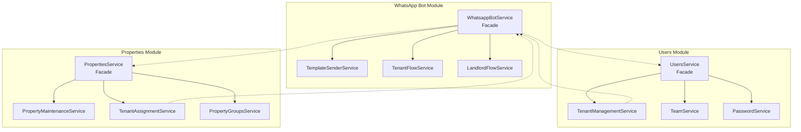
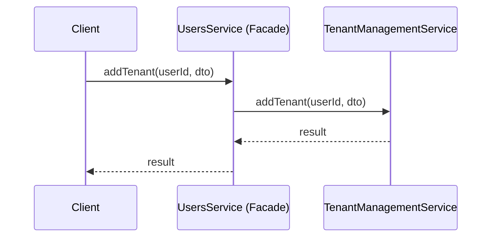

# Design Document: Service Refactoring

## Overview

This design document outlines the technical approach for refactoring three oversized NestJS service files into smaller, cohesive domain modules. The refactoring follows the Facade Pattern to maintain backward compatibility while extracting focused services that adhere to the Single Responsibility Principle.

The three target services and their proposed extractions:

1. **WhatsApp Bot Service** (3,812 lines) → Extract:
   - `TemplateSenderService` (~600 lines)
   - `TenantFlowService` (~400 lines)
   - `LandlordFlowService` (~500 lines)
   - Remaining core: ~800 lines

2. **Users Service** (3,675 lines) → Extract:
   - `TenantManagementService` (~800 lines)
   - `TeamService` (~300 lines)
   - `PasswordService` (~200 lines)
   - Remaining core: ~700 lines

3. **Properties Service** (3,647 lines) → Extract:
   - `PropertyMaintenanceService` (~700 lines)
   - `TenantAssignmentService` (~600 lines)
   - `PropertyGroupsService` (~200 lines)
   - Remaining core: ~700 lines

## Architecture

### High-Level Architecture



### Facade Pattern Implementation

Each original service becomes a facade that:

1. Maintains all existing public method signatures
2. Delegates to extracted services for implementation
3. Handles cross-cutting concerns (logging, error handling)
4. Provides a stable API for external consumers



## Components and Interfaces

### WhatsApp Bot Module Components

#### TemplateSenderService

```typescript
@Injectable()
export class TemplateSenderService {
  constructor(
    private readonly configService: ConfigService,
    private readonly httpService: HttpService,
  ) {}

  // Core API communication
  async sendToWhatsappAPI(payload: WhatsappPayload): Promise<void>;

  // Generic template sender
  async sendWhatsappMessageWithTemplate(params: TemplateParams): Promise<void>;

  // Specific templates
  async sendToUserWithTemplate(
    phoneNumber: string,
    customerName: string,
  ): Promise<void>;
  async sendToAgentWithTemplate(phoneNumber: string): Promise<void>;
  async sendToFacilityManagerWithTemplate(
    params: FMTemplateParams,
  ): Promise<void>;
  async sendToPropertiesCreatedTemplate(
    params: PropertyTemplateParams,
  ): Promise<void>;
  async sendUserAddedTemplate(params: UserAddedParams): Promise<void>;
  async sendTenantWelcomeTemplate(params: TenantWelcomeParams): Promise<void>;
  async sendTenantConfirmationTemplate(
    params: TenantConfirmParams,
  ): Promise<void>;
  // ... additional template methods
}
```

#### TenantFlowService

```typescript
@Injectable()
export class TenantFlowService {
  constructor(
    @InjectRepository(Users) private usersRepo: Repository<Users>,
    @InjectRepository(ServiceRequest)
    private serviceRequestRepo: Repository<ServiceRequest>,
    @InjectRepository(PropertyTenant)
    private propertyTenantRepo: Repository<PropertyTenant>,
    private readonly cache: CacheService,
    private readonly templateSender: TemplateSenderService,
    private readonly utilService: UtilService,
  ) {}

  async handleText(message: IncomingMessage, from: string): Promise<void>;
  async handleInteractive(
    message: IncomingMessage,
    from: string,
  ): Promise<void>;
  async cachedResponse(from: string, text: string): Promise<void>;

  // Helper methods
  private async processServiceRequest(
    from: string,
    text: string,
  ): Promise<void>;
  private async showTenancyDetails(from: string): Promise<void>;
}
```

#### LandlordFlowService

```typescript
@Injectable()
export class LandlordFlowService {
  constructor(
    @InjectRepository(ServiceRequest)
    private serviceRequestRepo: Repository<ServiceRequest>,
    @InjectRepository(TeamMember)
    private teamMemberRepo: Repository<TeamMember>,
    private readonly cache: CacheService,
    private readonly templateSender: TemplateSenderService,
    private readonly utilService: UtilService,
    private readonly landlordFlow: LandlordFlow,
  ) {}

  async handleFacilityText(
    message: IncomingMessage,
    from: string,
  ): Promise<void>;
  async handleFacilityInteractive(
    message: IncomingMessage,
    from: string,
  ): Promise<void>;
  async cachedFacilityResponse(from: string, text: string): Promise<void>;

  // Delegation to existing LandlordFlow
  async handleLandlordText(from: string, text: string): Promise<void>;
  async handleLandlordInteractive(
    message: IncomingMessage,
    from: string,
  ): Promise<void>;
}
```

### Users Module Components

#### TenantManagementService

```typescript
@Injectable()
export class TenantManagementService {
  constructor(
    @InjectRepository(Users) private usersRepository: Repository<Users>,
    @InjectRepository(Account) private accountRepository: Repository<Account>,
    @InjectRepository(PropertyTenant)
    private propertyTenantRepository: Repository<PropertyTenant>,
    @InjectRepository(Rent) private rentRepository: Repository<Rent>,
    @InjectRepository(KYCApplication)
    private kycApplicationRepository: Repository<KYCApplication>,
    private readonly dataSource: DataSource,
    private readonly utilService: UtilService,
    private readonly eventEmitter: EventEmitter2,
    @Inject(forwardRef(() => WhatsappBotService))
    private readonly whatsappBotService: WhatsappBotService,
  ) {}

  async addTenant(userId: string, dto: CreateTenantDto): Promise<Users>;
  async addTenantKyc(userId: string, dto: CreateTenantKycDto): Promise<Users>;
  async attachTenantToProperty(
    tenantId: string,
    dto: AttachTenantToPropertyDto,
    landlordId: string,
  ): Promise<AttachResult>;
  async attachTenantFromKyc(
    landlordId: string,
    dto: KycAttachDto,
  ): Promise<void>;
  async getAllTenants(queryParams: UserFilter): Promise<PaginatedResult<Users>>;
  async getTenantsOfAnAdmin(
    creatorId: string,
    queryParams: UserFilter,
  ): Promise<PaginatedResult<Users>>;
  async getSingleTenantOfAnAdmin(
    tenantId: string,
    adminId: string,
  ): Promise<TenantDetailDto>;
  async getTenantAndPropertyInfo(tenantId: string): Promise<TenantPropertyInfo>;

  // Private helpers
  private async handleTenantFromKyc(
    landlordId: string,
    dto: KycAttachDto,
  ): Promise<Users>;
  private calculateNextRentDate(
    startDate: Date,
    frequency: RentFrequency,
  ): Date;
  private mapRentFrequencyToPaymentFrequency(frequency: RentFrequency): string;
}
```

#### TeamService

```typescript
@Injectable()
export class TeamService {
  constructor(
    @InjectRepository(Team) private teamRepository: Repository<Team>,
    @InjectRepository(TeamMember)
    private teamMemberRepository: Repository<TeamMember>,
    @InjectRepository(Account) private accountRepository: Repository<Account>,
    private readonly utilService: UtilService,
    @Inject(forwardRef(() => WhatsappBotService))
    private readonly whatsappBotService: WhatsappBotService,
  ) {}

  async assignCollaboratorToTeam(
    userId: string,
    teamMember: TeamMemberInput,
  ): Promise<TeamMember>;
  async getTeamMembers(requester: Account): Promise<TeamMemberDto[]>;
  async updateTeamMember(
    id: string,
    data: UpdateTeamMemberDto,
    requester: Account,
  ): Promise<TeamMember>;
  async deleteTeamMember(id: string, requester: Account): Promise<void>;

  // Private helpers
  private validateLandlordRole(requester: Account): void;
}
```

#### PasswordService

```typescript
@Injectable()
export class PasswordService {
  constructor(
    @InjectRepository(Account) private accountRepository: Repository<Account>,
    @InjectRepository(PasswordResetToken)
    private passwordResetRepository: Repository<PasswordResetToken>,
    private readonly configService: ConfigService,
    private readonly utilService: UtilService,
    private readonly dataSource: DataSource,
  ) {}

  async forgotPassword(email: string): Promise<void>;
  async resetPassword(payload: ResetPasswordDto, res: Response): Promise<void>;
  async generatePasswordResetToken(
    userId: string,
    queryRunner: QueryRunner,
  ): Promise<string>;

  // Private helpers
  private async validateResetToken(token: string): Promise<PasswordResetToken>;
  private async sendPasswordResetEmail(
    email: string,
    token: string,
  ): Promise<void>;
}
```

### Properties Module Components

#### PropertyMaintenanceService

```typescript
@Injectable()
export class PropertyMaintenanceService {
  constructor(
    @InjectRepository(Property)
    private propertyRepository: Repository<Property>,
    @InjectRepository(PropertyTenant)
    private propertyTenantRepository: Repository<PropertyTenant>,
    @InjectRepository(Rent) private rentRepository: Repository<Rent>,
    @InjectRepository(Account) private accountRepository: Repository<Account>,
    private readonly dataSource: DataSource,
    private readonly logger: Logger,
  ) {}

  async fixTenantDataLeakage(landlordId?: string): Promise<FixResult>;
  async checkTenantDataFix(landlordId: string): Promise<CheckResult>;
  async diagnoseTenantDataLeakage(
    landlordId: string,
  ): Promise<DiagnosticResult>;
  async cleanupDuplicateTenantAssignments(
    landlordId: string,
  ): Promise<CleanupResult>;
  async fixOrphanedRentRecords(landlordId: string): Promise<FixResult>;
  async checkAndFixRentConsistency(
    adminId?: string,
  ): Promise<ConsistencyResult>;
  async fixSpecificRentRecord(
    rentId: string,
    adminId?: string,
  ): Promise<FixResult>;

  // Private helpers
  private logMaintenanceOperation(operation: string, details: any): void;
}
```

#### TenantAssignmentService

```typescript
@Injectable()
export class TenantAssignmentService {
  constructor(
    @InjectRepository(Property)
    private propertyRepository: Repository<Property>,
    @InjectRepository(PropertyTenant)
    private propertyTenantRepository: Repository<PropertyTenant>,
    @InjectRepository(PropertyHistory)
    private propertyHistoryRepository: Repository<PropertyHistory>,
    @InjectRepository(ScheduledMoveOut)
    private scheduledMoveOutRepository: Repository<ScheduledMoveOut>,
    @InjectRepository(Rent) private rentRepository: Repository<Rent>,
    private readonly dataSource: DataSource,
    private readonly eventEmitter: EventEmitter2,
    @Inject(forwardRef(() => WhatsappBotService))
    private readonly whatsappBotService: WhatsappBotService,
  ) {}

  async moveTenantIn(moveInData: MoveTenantInDto): Promise<void>;
  async moveTenantOut(
    moveOutData: MoveTenantOutDto,
    requesterId?: string,
  ): Promise<void>;
  async processScheduledMoveOuts(): Promise<void>;
  async getScheduledMoveOuts(ownerId?: string): Promise<ScheduledMoveOut[]>;
  async cancelScheduledMoveOut(
    scheduleId: string,
    ownerId?: string,
  ): Promise<void>;
  async assignTenant(propertyId: string, data: AssignTenantDto): Promise<void>;

  // Private helpers
  private async scheduleMoveTenantOut(
    moveOutData: MoveTenantOutDto,
    requesterId?: string,
  ): Promise<void>;
  private async processMoveTenantOut(
    moveOutData: MoveTenantOutDto,
    requesterId?: string,
  ): Promise<void>;
  private async verifyMoveOutTransaction(
    queryRunner: QueryRunner,
    propertyId: string,
    tenantId: string,
  ): Promise<boolean>;
  private async verifyMoveOutComplete(
    propertyId: string,
    tenantId: string,
  ): Promise<boolean>;
  private async createPropertyHistoryRecord(
    data: HistoryRecordData,
  ): Promise<void>;
}
```

#### PropertyGroupsService

```typescript
@Injectable()
export class PropertyGroupsService {
  constructor(
    @InjectRepository(PropertyGroup)
    private propertyGroupRepository: Repository<PropertyGroup>,
    @InjectRepository(Property)
    private propertyRepository: Repository<Property>,
  ) {}

  async createPropertyGroup(
    data: CreatePropertyGroupDto,
    ownerId: string,
  ): Promise<PropertyGroup>;
  async getPropertyGroupById(
    id: string,
    ownerId: string,
  ): Promise<PropertyGroup>;
  async getAllPropertyGroups(ownerId: string): Promise<PropertyGroup[]>;

  // Private helpers
  private validateOwnership(group: PropertyGroup, ownerId: string): void;
}
```

## Data Models

### Existing Entities (No Changes Required)

The refactoring does not modify existing database entities. All services will continue to use:

- `Users` - User entity with personal information
- `Account` - Account entity with authentication and role data
- `Property` - Property entity with property details
- `PropertyTenant` - Junction entity for property-tenant relationships
- `PropertyGroup` - Property grouping entity
- `PropertyHistory` - Property event history
- `ScheduledMoveOut` - Scheduled move-out records
- `Rent` - Rent records
- `ServiceRequest` - Service request entity
- `Team` - Team entity
- `TeamMember` - Team member entity
- `PasswordResetToken` - Password reset tokens
- `KYCApplication` - KYC application records

### New DTOs and Interfaces

```typescript
// Result types for maintenance operations
interface FixResult {
  message: string;
  fixed: boolean;
  details: FixDetails | null;
}

interface FixDetails {
  affectedRecords: string[];
  operationType: string;
  timestamp: Date;
}

interface CheckResult {
  message: string;
  isFixed: boolean;
  details: CheckDetails | null;
}

interface CheckDetails {
  checkedRecords: number;
  issuesFound: number;
  lastChecked: Date;
}

interface DiagnosticResult {
  message: string;
  issues: DiagnosticIssue[];
}

interface DiagnosticIssue {
  type: string;
  description: string;
  affectedRecords: number;
  recommendation: string;
}

interface CleanupResult {
  message: string;
  success: boolean;
  removedCount: number;
}

interface ConsistencyResult {
  message: string;
  issues: ConsistencyIssue[];
  fixedCount: number;
}

interface ConsistencyIssue {
  rentId: string;
  propertyId: string;
  tenantId: string;
  issueType:
    | 'orphaned'
    | 'duplicate'
    | 'status_mismatch'
    | 'date_inconsistency';
  description: string;
}

// Template parameter types
interface TemplateParams {
  phone_number: string;
  template_name: string;
  language_code: string;
  components: TemplateComponent[];
}

interface TemplateComponent {
  type: 'header' | 'body' | 'button';
  parameters: TemplateParameter[];
}

interface TemplateParameter {
  type: 'text' | 'currency' | 'date_time' | 'image' | 'document' | 'video';
  text?: string;
  currency?: CurrencyParameter;
  date_time?: DateTimeParameter;
  image?: MediaParameter;
  document?: MediaParameter;
  video?: MediaParameter;
}

interface CurrencyParameter {
  fallback_value: string;
  code: string;
  amount_1000: number;
}

interface DateTimeParameter {
  fallback_value: string;
}

interface MediaParameter {
  link: string;
}

interface FMTemplateParams {
  phone_number: string;
  name: string;
  team: string;
  role: string;
}

interface TenantWelcomeParams {
  phone_number: string;
  tenant_name: string;
  landlord_name: string;
}

interface PropertyTemplateParams {
  phone_number: string;
  name: string;
  property_name: string;
}

interface UserAddedParams {
  phone_number: string;
  name: string;
  user: string;
  property_name: string;
}

interface TenantConfirmParams {
  phone_number: string;
  tenant_name: string;
  property_name: string;
  landlord_name: string;
  move_in_date: string;
}

// Attachment result type
interface AttachResult {
  success: boolean;
  message: string;
  tenantId: string;
  propertyId: string;
}

// Tenant property info type
interface TenantPropertyInfo {
  tenant: TenantInfo;
  property: PropertyInfo | null;
  rent: RentInfo | null;
}

interface TenantInfo {
  id: string;
  firstName: string;
  lastName: string;
  email: string;
  phoneNumber: string;
}

interface PropertyInfo {
  id: string;
  name: string;
  address: string;
  status: PropertyStatusEnum;
}

interface RentInfo {
  id: string;
  amount: number;
  dueDate: Date;
  status: RentStatusEnum;
  paymentStatus: RentPaymentStatusEnum;
}

// KYC attach DTO type
interface KycAttachDto {
  kycApplicationId: string;
  propertyId: string;
  rentAmount: number;
  rentFrequency: string;
  tenancyStartDate: string;
  rentDueDate: string;
  serviceCharge: number;
}

// WhatsApp message types
interface WhatsappPayload {
  messaging_product: 'whatsapp';
  recipient_type: 'individual';
  to: string;
  type: 'template' | 'text' | 'interactive';
  template?: WhatsappTemplate;
  text?: WhatsappText;
  interactive?: WhatsappInteractive;
}

interface WhatsappTemplate {
  name: string;
  language: { code: string };
  components: TemplateComponent[];
}

interface WhatsappText {
  preview_url: boolean;
  body: string;
}

interface WhatsappInteractive {
  type: 'button' | 'list';
  header?: InteractiveHeader;
  body: InteractiveBody;
  footer?: InteractiveFooter;
  action: InteractiveAction;
}

interface InteractiveHeader {
  type: 'text' | 'image' | 'video' | 'document';
  text?: string;
}

interface InteractiveBody {
  text: string;
}

interface InteractiveFooter {
  text: string;
}

interface InteractiveAction {
  buttons?: InteractiveButton[];
  sections?: InteractiveSection[];
}

interface InteractiveButton {
  type: 'reply';
  reply: { id: string; title: string };
}

interface InteractiveSection {
  title: string;
  rows: InteractiveSectionRow[];
}

interface InteractiveSectionRow {
  id: string;
  title: string;
  description?: string;
}

// Property history record data
interface HistoryRecordData {
  propertyId: string;
  tenantId: string;
  eventType:
    | 'tenancy_started'
    | 'tenancy_ended'
    | 'rent_updated'
    | 'property_created'
    | 'property_updated';
  moveInDate?: Date;
  moveOutDate?: Date;
  moveOutReason?: string;
  monthlyRent?: number;
  ownerComment?: string;
  tenantComment?: string;
}

// Team member input type
interface TeamMemberInput {
  email: string;
  firstName: string;
  lastName: string;
  phoneNumber: string;
  role: RolesEnum;
}

// Update team member DTO
interface UpdateTeamMemberDto {
  firstName?: string;
  lastName?: string;
  phoneNumber?: string;
  role?: RolesEnum;
}
```

## Correctness Properties

_A property is a characteristic or behavior that should hold true across all valid executions of a system—essentially, a formal statement about what the system should do. Properties serve as the bridge between human-readable specifications and machine-verifiable correctness guarantees._

Based on the prework analysis, the following correctness properties have been identified and consolidated to eliminate redundancy:

### Property 1: Facade Delegation Correctness

_For any_ facade method in the original services (WhatsApp_Bot_Service, Users_Service, Properties_Service) that has been refactored to delegate to an extracted service, calling the facade method with any valid input should invoke the corresponding method on the extracted service with the same arguments and return the same result.

**Validates: Requirements 1.4, 2.5, 3.5, 4.9, 5.5, 6.4, 7.8, 8.10, 9.4, 10.4, 10.5**

### Property 2: Method Signature Compatibility

_For any_ method that has been moved from an original service to an extracted service, the method signature (parameter types, return type, and method name) in the facade delegation method shall be identical to the original method signature before refactoring.

**Validates: Requirements 1.6, 10.1, 10.2, 10.3, 10.6**

### Property 3: Service Size Compliance

_For any_ service file (both original facades and extracted services) after refactoring, the line count shall be less than or equal to 800 lines.

**Validates: Requirements 11.1, 11.2, 11.3, 11.4**

### Property 4: Constructor Injection Pattern

_For any_ extracted service, all dependencies shall be declared as constructor parameters and injected through NestJS dependency injection, with no dependencies acquired through other means (e.g., service locator, global state).

**Validates: Requirements 12.3, 13.1**

### Property 5: Mock Instantiation Capability

_For any_ extracted service, it shall be possible to instantiate the service with mock implementations of all its dependencies, enabling isolated unit testing without requiring real database connections or external services.

**Validates: Requirements 13.3, 13.4**

### Property 6: Role-Based Access Control Enforcement

_For any_ operation in Team_Service or Property_Groups_Service that requires authorization, if the requester does not have the required role (LANDLORD for team operations, owner for property groups), the operation shall throw a ForbiddenException without modifying any data.

**Validates: Requirements 5.6, 9.5**

### Property 7: Transaction Integrity for Multi-Step Operations

_For any_ multi-step operation in Tenant_Management_Service (addTenant, addTenantKyc, attachTenantToProperty, attachTenantFromKyc), if any step fails, all previous steps in the same transaction shall be rolled back, leaving the database in its original state.

**Validates: Requirements 4.10**

### Property 8: Property History Record Creation

_For any_ tenant move operation (moveTenantIn, moveTenantOut, processMoveTenantOut) in Tenant_Assignment_Service, a corresponding PropertyHistory record shall be created with the correct event_type, property_id, tenant_id, and relevant dates.

**Validates: Requirements 8.11**

### Property 9: Maintenance Operation Audit Logging

_For any_ fix or cleanup operation in Property_Maintenance_Service (fixTenantDataLeakage, cleanupDuplicateTenantAssignments, fixOrphanedRentRecords, checkAndFixRentConsistency, fixSpecificRentRecord), the operation shall log the operation type, affected records, and outcome for audit purposes.

**Validates: Requirements 7.9**

### Property 10: Password Token Lifecycle

_For any_ password reset token generated by Password_Service, the token shall be valid for validation within its expiry period, and invalid after expiry or after being used once.

**Validates: Requirements 6.5**

### Property 11: Strict Type Safety Compliance

_For any_ extracted service file, there shall be zero occurrences of the `any` type keyword (excluding type guards and legitimate `unknown` narrowing), and all method signatures shall have explicit parameter and return type annotations.

**Validates: Requirements 14.1, 14.2, 14.3, 14.4**

## Error Handling

### Facade Error Propagation

Facade methods shall propagate errors from extracted services without modification:

```typescript
// In UsersService (facade)
async addTenant(userId: string, dto: CreateTenantDto): Promise<Users> {
  try {
    return await this.tenantManagementService.addTenant(userId, dto);
  } catch (error) {
    // Re-throw without modification to maintain error contract
    throw error;
  }
}
```

### Transaction Rollback

Multi-step operations use TypeORM transactions with automatic rollback:

```typescript
async addTenant(userId: string, dto: CreateTenantDto): Promise<Users> {
  return await this.dataSource.transaction(async (manager) => {
    // All operations within this block are atomic
    // If any operation throws, all changes are rolled back
    const user = await manager.save(Users, userData);
    const account = await manager.save(Account, accountData);
    const rent = await manager.save(Rent, rentData);
    return user;
  });
}
```

### Authorization Errors

Role-based access control throws ForbiddenException:

```typescript
private validateLandlordRole(requester: Account): void {
  if (requester.role !== RolesEnum.LANDLORD) {
    throw new ForbiddenException('Only landlords can perform this operation');
  }
}
```

### Not Found Errors

Entity lookups throw NotFoundException when entity doesn't exist:

```typescript
async getPropertyGroupById(id: string, ownerId: string): Promise<PropertyGroup> {
  const group = await this.propertyGroupRepository.findOne({
    where: { id, owner_id: ownerId },
  });
  if (!group) {
    throw new NotFoundException(`Property group with id ${id} not found`);
  }
  return group;
}
```

## Testing Strategy

### Dual Testing Approach

The refactoring requires both unit tests and property-based tests:

1. **Unit Tests**: Verify specific examples, edge cases, and error conditions
2. **Property Tests**: Verify universal properties across all inputs

### Unit Testing Focus

Unit tests should cover:

- Specific delegation examples for each facade method
- Error handling paths (not found, forbidden, validation errors)
- Edge cases in business logic
- Integration points between services

### Property-Based Testing Configuration

- **Library**: Use `fast-check` for TypeScript property-based testing
- **Minimum iterations**: 100 per property test
- **Tag format**: `Feature: service-refactoring, Property {number}: {property_text}`

### Test Structure

```
src/
├── whatsapp-bot/
│   ├── template-sender/
│   │   ├── template-sender.service.ts
│   │   └── template-sender.service.spec.ts
│   ├── tenant-flow/
│   │   ├── tenant-flow.service.ts
│   │   └── tenant-flow.service.spec.ts
│   └── landlord-flow/
│       ├── landlord-flow.service.ts
│       └── landlord-flow.service.spec.ts
├── users/
│   ├── tenant-management/
│   │   ├── tenant-management.service.ts
│   │   └── tenant-management.service.spec.ts
│   ├── team/
│   │   ├── team.service.ts
│   │   └── team.service.spec.ts
│   └── password/
│       ├── password.service.ts
│       └── password.service.spec.ts
└── properties/
    ├── maintenance/
    │   ├── property-maintenance.service.ts
    │   └── property-maintenance.service.spec.ts
    ├── tenant-assignment/
    │   ├── tenant-assignment.service.ts
    │   └── tenant-assignment.service.spec.ts
    └── groups/
        ├── property-groups.service.ts
        └── property-groups.service.spec.ts
```

### Property Test Examples

```typescript
// Property 1: Facade Delegation
describe('Feature: service-refactoring, Property 1: Facade Delegation', () => {
  it('should delegate all tenant operations to TenantManagementService', () => {
    fc.assert(
      fc.property(
        fc.record({
          userId: fc.uuid(),
          dto: createTenantDtoArbitrary,
        }),
        async ({ userId, dto }) => {
          const mockTenantService = { addTenant: jest.fn() };
          const facade = new UsersService(/* ... */, mockTenantService);

          await facade.addTenant(userId, dto);

          expect(mockTenantService.addTenant).toHaveBeenCalledWith(userId, dto);
        }
      ),
      { numRuns: 100 }
    );
  });
});

// Property 6: Role-Based Access Control
describe('Feature: service-refactoring, Property 6: Role-Based Access Control', () => {
  it('should reject non-landlord requesters for team operations', () => {
    fc.assert(
      fc.property(
        fc.constantFrom(RolesEnum.TENANT, RolesEnum.FACILITY_MANAGER, RolesEnum.ADMIN),
        async (role) => {
          const requester = { role } as Account;
          const teamService = new TeamService(/* ... */);

          await expect(teamService.getTeamMembers(requester))
            .rejects.toThrow(ForbiddenException);
        }
      ),
      { numRuns: 100 }
    );
  });
});

// Property 7: Transaction Integrity
describe('Feature: service-refactoring, Property 7: Transaction Integrity', () => {
  it('should rollback all changes when any step fails', () => {
    fc.assert(
      fc.property(
        fc.integer({ min: 1, max: 5 }), // Step to fail at
        async (failAtStep) => {
          const mockManager = createFailingManager(failAtStep);
          const service = new TenantManagementService(/* ... */);

          const initialState = await getDbState();

          try {
            await service.addTenant(userId, dto);
          } catch (e) {
            // Expected to fail
          }

          const finalState = await getDbState();
          expect(finalState).toEqual(initialState);
        }
      ),
      { numRuns: 100 }
    );
  });
});
```

### Mocking Strategy

Each extracted service should be testable with mocked dependencies:

```typescript
describe('TenantManagementService', () => {
  let service: TenantManagementService;
  let mockUsersRepo: jest.Mocked<Repository<Users>>;
  let mockAccountRepo: jest.Mocked<Repository<Account>>;
  let mockDataSource: jest.Mocked<DataSource>;

  beforeEach(() => {
    mockUsersRepo = createMockRepository();
    mockAccountRepo = createMockRepository();
    mockDataSource = createMockDataSource();

    service = new TenantManagementService(
      mockUsersRepo,
      mockAccountRepo,
      /* ... other mocked dependencies */
    );
  });

  // Tests...
});
```
